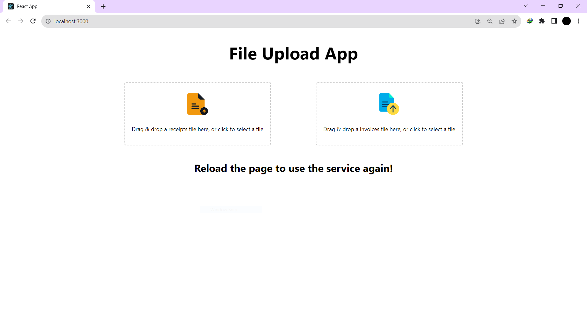

## MVP

## Description

Here's a step by step tutorial to get this project running on your local machine

## Frontend Setup

To set up the frontend of the project, follow these steps:

1. Change directory to the frontend folder:
   ```bash
   cd frontend
   ```

2. Install the necessary dependencies using npm:
   ```bash
   npm install --force
   ```

3. Start the frontend application:
   ```bash
   npm start
   ```

### Using Docker for Frontend

If you prefer to use Docker for the frontend, here are the steps:

1. Change directory to the frontend folder:
   ```bash
   cd frontend
   ```

2. Build a Docker image for the frontend application (tagged as `frontend:latest`):
   ```bash
   docker image build -t frontend:latest .
   ```

3. Run the Docker container, mapping port 8000 on your host to port 3000 in the container, and name it "frontend":
   ```bash
   docker run -dp 8000:3000 --name frontend frontend:latest
   ```
   
   Your frontend would be up and running on localhost:8000

Here's a screenshot of what the basic frontend would look like:


## Backend Setup

To set up the backend of the project, follow these steps:

1. Add your AWS credentials in a `.env` file.

2. Add your OpenAI credentials in a `config.txt` file.

3. Change directory to the backend folder:
   ```bash
   cd backend
   ```

4. Install the required Python dependencies using pip:
   ```bash
   pip install -r requirements.txt
   ```

5. Start the backend application:
   ```bash
   python app.py
   ```

### Using Docker for Backend

If you prefer to use Docker for the backend, here are the steps:

1. Change directory to the backend folder:
   ```bash
   cd backend
   ```

2. Build a Docker image for the backend application (tagged as `backend`):
   ```bash
   docker build -t backend .
   ```

3. Verify that the Docker image has been successfully built:
   ```bash
   docker images
   ```

4. Run the Docker container, mapping port 5001 on your host to port 5001 in the container:
   ```bash
   docker run -d -p 5001:5001 backend
   ```

5. Verify that the container is running:
   ```bash
   docker ps
   ```
 Your backend would be up and running on localhost:5001
## Usage

On the frontend, there are two buttons:
1. Upload receipts
2. Upload invoices
The receipts is using chatgpt on the frontend and the downloadable file would be available after the execution.
The invoices is using AWS Textract and the downloadable file would be available after the execution. 


---
